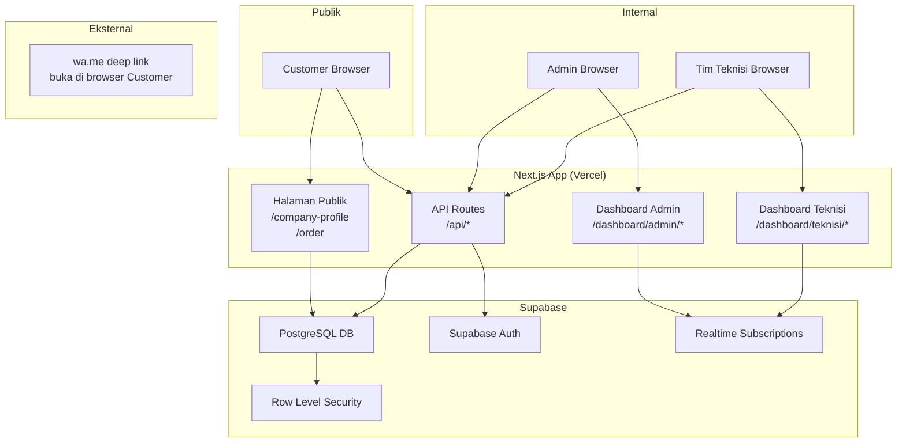
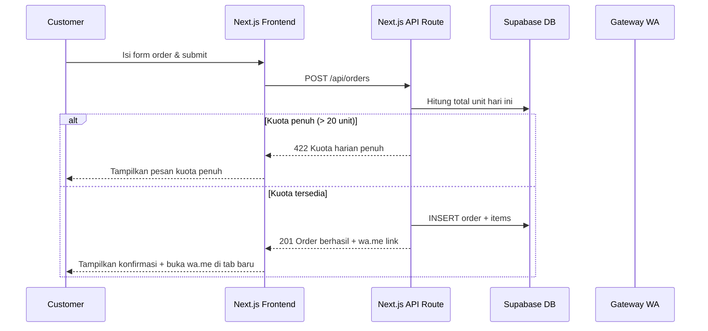
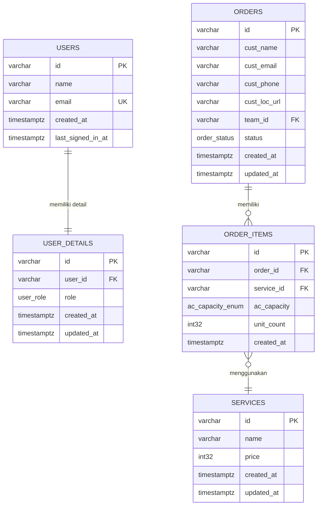
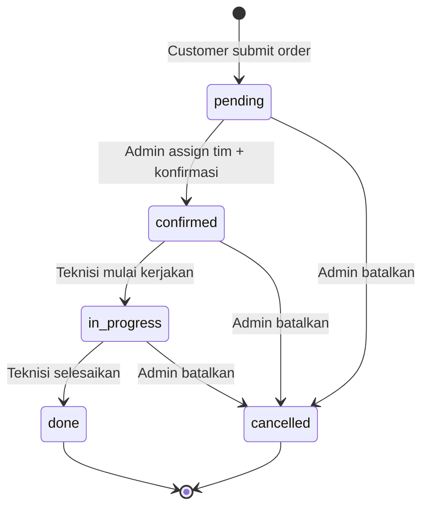

# Dokumen Desain Teknis — AC Maintenance Service

## Daftar Isi

1. [Overview](#overview)
2. [Arsitektur](#arsitektur)
3. [Komponen dan Antarmuka](#komponen-dan-antarmuka)
4. [Model Data](#model-data)
5. [Correctness Properties](#correctness-properties)
6. [Penanganan Error](#penanganan-error)
7. [Strategi Pengujian](#strategi-pengujian)

---

## Overview

AC Maintenance Service adalah aplikasi web operasional ringan yang melayani dua kelompok pengguna utama:

- **Publik (Customer)**: Mengakses company profile, simulator freon, dan form order tanpa akun.
- **Internal (Admin & Tim Teknisi)**: Mengelola order, assign tim, dan memantau analitik melalui dashboard yang dilindungi autentikasi.

### Tujuan Sistem

- Menyediakan saluran pemesanan service AC secara online tanpa memerlukan akun customer.
- Mengotomatiskan notifikasi WhatsApp ke Admin saat order baru masuk.
- Memberikan visibilitas operasional kepada Admin melalui dashboard manajemen order dan analitik.
- Membatasi akses Tim Teknisi hanya pada order yang di-assign ke timnya.

### Batasan Sistem

- Tidak ada fitur pembayaran online.
- Tidak ada penjadwalan otomatis.
- Tidak ada akun customer (order bersifat anonim).
- Kuota harian maksimal 20 unit per hari kalender.

### Tech Stack

| Layer | Teknologi |
|---|---|
| Frontend | Next.js (JavaScript, `.js`/`.jsx`) |
| UI Components | DaisyUI di atas Tailwind CSS |
| Backend / Database | Supabase (PostgreSQL + Realtime) |
| Autentikasi | Supabase Auth |
| Notifikasi WA | `wa.me` deep link (dibuka di browser Customer) |
| Deployment | Vercel (Next.js) |

---

## Arsitektur

### Diagram Arsitektur Tingkat Tinggi



### Pola Arsitektur

Aplikasi menggunakan pola **BFF (Backend for Frontend)** melalui Next.js API Routes sebagai lapisan antara frontend dan Supabase. Ini memungkinkan:

1. **Validasi server-side** sebelum data menyentuh database.
2. **Logika bisnis terpusat** (pengecekan kuota, pengiriman notifikasi WA).
3. **Keamanan** — kunci API Supabase service role tidak terekspos ke browser.

### Alur Request Utama



### Strategi Row Level Security (RLS)

Supabase RLS digunakan sebagai lapisan keamanan kedua di level database:

| Tabel | Akses Publik | Admin | Tim Teknisi |
|---|---|---|---|
| `orders` | INSERT (via API) | SELECT/UPDATE semua | SELECT/UPDATE milik tim sendiri |
| `order_items` | INSERT (via API) | SELECT semua | SELECT milik tim sendiri |
| `services` | SELECT | SELECT/INSERT/UPDATE | SELECT |
| `users` | - | SELECT/INSERT/UPDATE | SELECT (diri sendiri) |
| `user_details` | - | SELECT/INSERT/UPDATE | SELECT (diri sendiri) |

---

## Komponen dan Antarmuka

### Struktur Direktori Proyek

```
ac-maintenance-service/
├── pages/
│   ├── index.jsx                    # Halaman publik (company profile)
│   ├── order.jsx                    # Form order publik
│   ├── login.jsx                    # Halaman login
│   ├── dashboard/
│   │   ├── admin/
│   │   │   ├── index.jsx            # Dashboard admin — daftar order
│   │   │   ├── orders/[id].jsx      # Detail order
│   │   │   ├── analytics.jsx        # Halaman analitik
│   │   │   └── settings/
│   │   │       ├── services.jsx     # Manajemen jenis layanan
│   │   │       └── teams.jsx        # Manajemen tim teknisi (akun user_details)
│   │   └── teknisi/
│   │       ├── index.jsx            # Dashboard teknisi — order tim
│   │       └── orders/[id].jsx      # Detail order teknisi
│   └── api/
│       ├── orders/
│       │   ├── index.js             # GET (list) + POST (create)
│       │   └── [id].js              # GET (detail) + PATCH (update status/assign)
│       ├── quota.js                 # GET sisa kuota harian
│       ├── services/
│       │   ├── index.js
│       │   └── [id].js
│       └── users/
│           ├── index.js
│           └── [id].js
├── components/
│   ├── public/
│   │   ├── Navbar.jsx
│   │   ├── HeroSection.jsx
│   │   ├── ServiceList.jsx
│   │   ├── FreonSimulator.jsx       # Simulator perbandingan freon
│   │   └── OrderForm.jsx            # Form order multi-item
│   ├── dashboard/
│   │   ├── OrderTable.jsx
│   │   ├── OrderDetail.jsx
│   │   ├── StatusBadge.jsx
│   │   ├── AssignTeamModal.jsx
│   │   ├── StatusUpdateModal.jsx
│   │   └── analytics/
│   │       ├── OrderTrendChart.jsx
│   │       ├── PopularServicesChart.jsx
│   │       ├── TeamProductivityTable.jsx
│   │       └── QuotaUtilizationChart.jsx
│   └── shared/
│       ├── Layout.jsx
│       ├── DashboardLayout.jsx
│       └── ProtectedRoute.jsx
├── lib/
│   ├── supabaseClient.js            # Supabase browser client
│   ├── supabaseAdmin.js             # Supabase service role client (server-side only)
│   ├── validators.js                # Fungsi validasi input
│   ├── quotaChecker.js              # Logika pengecekan kuota harian
│   ├── waLink.js                    # Logika pembuatan tautan wa.me
│   └── freonCalculator.js           # Logika kalkulasi simulator freon
├── hooks/
│   ├── useOrders.js                 # Hook untuk fetch & realtime orders
│   ├── useAuth.js                   # Hook autentikasi
│   └── useQuota.js                  # Hook untuk sisa kuota harian
└── styles/
    └── globals.css
```

### Komponen Utama

#### 1. `FreonSimulator` (Komponen Publik)

Kalkulator interaktif yang menerima input dan menampilkan perbandingan konsumsi energi.

**Props:** Tidak ada (self-contained)

**State Internal:**
- `pk` — kapasitas AC dalam PK
- `jumlahUnit` — jumlah unit AC
- `tarifKwh` — tarif listrik per kWh (Rp)
- `jamPerHari` — jam pemakaian per hari
- `result` — objek hasil kalkulasi (lihat return type di bawah)
- `errors` — objek error validasi per field

**Antarmuka Kalkulasi (`freonCalculator.js`):**
```js
/**
 * Menghitung perbandingan daya dan biaya listrik bulanan antara
 * freon konvensional dan freon hemat energi (smat-trik).
 *
 * @param {number} pk         - Kapasitas AC dalam PK (contoh: 0.5, 1, 1.5, 2)
 * @param {number} jumlahUnit - Jumlah unit AC
 * @param {number} tarifKwh   - Tarif listrik per kWh (Rp)
 * @param {number} jamPerHari - Jam pemakaian per hari
 * @returns {{
 *   dayaKonv:    number,  // Daya total freon konvensional (Watt)
 *   dayaSmat:    number,  // Daya total freon smat-trik (Watt)
 *   biayaKonv:   number,  // Biaya listrik bulanan konvensional (Rp, dibulatkan)
 *   biayaSmat:   number,  // Biaya listrik bulanan smat-trik (Rp, dibulatkan)
 *   hematNominal: number, // Selisih penghematan per bulan (Rp, dibulatkan)
 *   hematPersen:  string  // Persentase penghematan (1 desimal, contoh: "27.5")
 * }}
 */
function hitungPenghematanAC(pk, jumlahUnit, tarifKwh, jamPerHari)
```

**Rumus Kalkulasi:**
```js
const TEGANGAN = 220; // Volt

// 1. Hitung Watt masing-masing tipe
const wattKonv = (pk * 4.0) * TEGANGAN * jumlahUnit;
const wattSmat = (pk * 2.9) * TEGANGAN * jumlahUnit;

// 2. Hitung kWh per hari
const kwhKonvHari = (wattKonv / 1000) * jamPerHari;
const kwhSmatHari = (wattSmat / 1000) * jamPerHari;

// 3. Hitung Biaya Bulanan (30 hari)
const biayaKonvBulan = kwhKonvHari * tarifKwh * 30;
const biayaSmatBulan = kwhSmatHari * tarifKwh * 30;

// 4. Hitung Penghematan
const totalPenghematanBulan = biayaKonvBulan - biayaSmatBulan;
const persentaseHemat = (totalPenghematanBulan / biayaKonvBulan) * 100;
```

**Konstanta dan Asumsi:**
- Tegangan: 220 Volt
- Faktor arus freon konvensional: 4.0 A/PK
- Faktor arus freon smat-trik: 2.9 A/PK
- Hari per bulan: 30 hari
- Penghematan smat-trik vs konvensional: ~27.5% (tetap untuk semua nilai input valid)

#### 2. `OrderForm` (Komponen Publik)

Form multi-step untuk pengisian order dengan dukungan multiple items.

**State Internal:**
- `customerInfo` — `{ custName, custEmail, custPhone, custLocUrl }`
- `items` — array `[{ serviceId, acCapacity, unitCount }]`
- `quotaInfo` — sisa kuota harian dari API
- `isSubmitting`, `submitError`, `submitSuccess`

**Validasi Client-side (`validators.js`):**
```js
validateCustomerInfo(customerInfo) // returns { isValid, errors }
validateOrderItem(item)            // returns { isValid, errors }
validateWhatsappNumber(number)     // returns boolean
validateEmail(email)               // returns boolean (RFC 5321)
```

#### 3. `ProtectedRoute` (Komponen Shared)

HOC (Higher-Order Component) yang memproteksi halaman dashboard.

```jsx
// Penggunaan
<ProtectedRoute allowedRoles={['admin']}>
  <AdminDashboard />
</ProtectedRoute>
```

**Logika:**
1. Cek sesi Supabase Auth.
2. Jika tidak ada sesi → redirect ke `/login`.
3. Cek role user dari tabel `user_details`.
4. Jika role tidak sesuai `allowedRoles` → redirect ke halaman yang sesuai atau tampilkan 403.

#### 4. API Routes

**`POST /api/orders`** — Membuat order baru

```
Request Body:
{
  customerInfo: { custName, custPhone, custLocUrl, custEmail? },  // custEmail opsional
  items: [{ serviceId, acCapacity, unitCount }]
}

Response 201:
{ orderId, status: "pending", waLink: "https://wa.me/628xxx?text=...", message: "Order berhasil disimpan" }

Response 422:
{ error: "QUOTA_EXCEEDED", message: "Kuota harian penuh", remainingQuota: 0 }

Response 400:
{ error: "VALIDATION_ERROR", fields: { ... } }
```

**`GET /api/quota`** — Mendapatkan sisa kuota harian

```
Query: ?date=YYYY-MM-DD (default: hari ini)

Response 200:
{ date, usedUnits, remainingUnits, maxUnits: 20 }
```

**`PATCH /api/orders/[id]`** — Update status atau assign tim

```
Request Body (update status):
{ action: "update_status", newStatus: "confirmed" | "in_progress" | "done" | "cancelled" }

Request Body (assign tim):
{ action: "assign_team", teamId: "uuid" }

Response 200:
{ orderId, status, assignedTeamId, updatedAt }

Response 403:
{ error: "FORBIDDEN", message: "Akses tidak diizinkan" }

Response 422:
{ error: "INVALID_TRANSITION", message: "Transisi status tidak valid" }
```

---

## Model Data

### Diagram Entity-Relationship



### Definisi Tabel

#### `users`

Tabel ini di-sync otomatis dari `auth.users` Supabase via trigger atau fungsi. Menyimpan data profil dasar pengguna internal (Admin & Tim Teknisi).

```sql
CREATE TABLE users (
  id               VARCHAR PRIMARY KEY,  -- sama dengan auth.users.id
  name             VARCHAR NOT NULL,
  email            VARCHAR NOT NULL UNIQUE,
  created_at       TIMESTAMPTZ NOT NULL DEFAULT NOW(),
  last_signed_in_at TIMESTAMPTZ
);
```

#### `user_details`

Menyimpan role dan informasi tambahan pengguna. Tim Teknisi diidentifikasi berdasarkan `role = 'teknisi'` — pengelompokan tim dilakukan via query pada tabel ini.

```sql
CREATE TYPE user_role AS ENUM ('admin', 'teknisi');

CREATE TABLE user_details (
  id         VARCHAR PRIMARY KEY DEFAULT gen_random_uuid(),
  user_id    VARCHAR NOT NULL UNIQUE REFERENCES users(id) ON DELETE CASCADE,
  role       user_role NOT NULL,
  created_at TIMESTAMPTZ NOT NULL DEFAULT NOW(),
  updated_at TIMESTAMPTZ NOT NULL DEFAULT NOW()
);
```

#### `orders`

`team_id` mereferensikan `users.id` dari pengguna dengan role `teknisi` yang di-assign ke order ini.

```sql
CREATE TYPE order_status AS ENUM (
  'pending', 'confirmed', 'in_progress', 'done', 'cancelled'
);

CREATE TABLE orders (
  id           VARCHAR PRIMARY KEY DEFAULT gen_random_uuid(),
  cust_name    VARCHAR NOT NULL,
  cust_email   VARCHAR,
  cust_phone   VARCHAR NOT NULL,
  cust_loc_url VARCHAR NOT NULL,
  team_id      VARCHAR REFERENCES users(id),
  status       order_status NOT NULL DEFAULT 'pending',
  created_at   TIMESTAMPTZ NOT NULL DEFAULT NOW(),
  updated_at   TIMESTAMPTZ NOT NULL DEFAULT NOW()
);
```

#### `order_items`

`ac_capacity` adalah enum yang merepresentasikan kapasitas AC langsung di tabel, tanpa tabel referensi terpisah.

```sql
CREATE TYPE ac_capacity_enum AS ENUM (
  '0.5_pk', '0.75_pk', '1_pk', '1.5_pk', '2_pk', '2.5_pk'
);

CREATE TABLE order_items (
  id          VARCHAR PRIMARY KEY DEFAULT gen_random_uuid(),
  order_id    VARCHAR NOT NULL REFERENCES orders(id) ON DELETE CASCADE,
  service_id  VARCHAR NOT NULL REFERENCES services(id),
  ac_capacity ac_capacity_enum NOT NULL,
  unit_count  INTEGER NOT NULL CHECK (unit_count >= 1),
  created_at  TIMESTAMPTZ NOT NULL DEFAULT NOW()
);
```

#### `services`

```sql
CREATE TABLE services (
  id         VARCHAR PRIMARY KEY DEFAULT gen_random_uuid(),
  name       VARCHAR NOT NULL UNIQUE,
  price      INTEGER NOT NULL DEFAULT 0,  -- harga dalam Rupiah
  created_at TIMESTAMPTZ NOT NULL DEFAULT NOW(),
  updated_at TIMESTAMPTZ NOT NULL DEFAULT NOW()
);
```

### Aturan Transisi Status Order



**Matriks Transisi yang Diizinkan:**

| Status Asal | Status Tujuan | Aktor |
|---|---|---|
| `pending` | `confirmed` | Admin (wajib ada assigned_team_id) |
| `pending` | `cancelled` | Admin |
| `confirmed` | `in_progress` | Tim Teknisi |
| `confirmed` | `cancelled` | Admin |
| `in_progress` | `done` | Tim Teknisi |
| `in_progress` | `cancelled` | Admin |

### Logika Kuota Harian

Kuota harian dihitung berdasarkan tanggal dari `created_at` order:

```sql
SELECT COALESCE(SUM(oi.unit_count), 0) AS used_units
FROM orders o
JOIN order_items oi ON oi.order_id = o.id
WHERE o.created_at::date = CURRENT_DATE
  AND o.status != 'cancelled';
```

Order baru dapat diterima jika: `used_units + new_order_total_units <= 20`


---

## Correctness Properties

*A property is a characteristic or behavior that should hold true across all valid executions of a system — essentially, a formal statement about what the system should do. Properties serve as the bridge between human-readable specifications and machine-verifiable correctness guarantees.*

### Property 1: Kalkulasi Freon Menghasilkan Nilai yang Benar dan Konsisten

*Untuk sembarang* nilai `pk` positif, `jumlahUnit` positif, `tarifKwh` positif, dan `jamPerHari` positif, fungsi `hitungPenghematanAC` harus menghasilkan: (1) `dayaSmat < dayaKonv`, (2) `biayaSmat < biayaKonv`, (3) `hematNominal === biayaKonv - biayaSmat`, dan (4) `hematPersen` konsisten dengan `(hematNominal / biayaKonv) * 100` dibulatkan ke 1 desimal. Persentase penghematan harus selalu ~27.5% karena merupakan konstanta dari rasio faktor arus (2.9/4.0).

**Validates: Requirements 2.2, 2.3**

---

### Property 2: Validasi Input Simulator Menolak Nilai Tidak Valid

*Untuk sembarang* input yang tidak valid pada simulator freon (nilai negatif, nol, non-numerik, atau melebihi batas wajar), fungsi validator harus mengembalikan error dan tidak menghasilkan hasil kalkulasi.

**Validates: Requirements 2.4**

---

### Property 3: Validasi Form Order Menolak Field Wajib yang Kosong

*Untuk sembarang* kombinasi input form order di mana setidaknya satu field wajib (nama lengkap, nomor WhatsApp, URL lokasi) kosong atau daftar items kosong, fungsi `validateCustomerInfo` harus mengembalikan `isValid: false` dengan pesan error yang sesuai.

**Validates: Requirements 3.3**

---

### Property 4: Validasi Format Nomor WhatsApp

*Untuk sembarang* string yang bukan format nomor WhatsApp Indonesia yang valid (tidak dimulai dengan `08` atau `628`, mengandung karakter non-digit, terlalu pendek < 10 digit, atau terlalu panjang > 15 digit), fungsi `validateWhatsappNumber` harus mengembalikan `false`.

**Validates: Requirements 3.4**

---

### Property 5: Validasi Format Email

*Untuk sembarang* string email yang tidak valid (tidak mengandung `@`, tidak memiliki domain, domain tanpa TLD, atau format lain yang melanggar RFC 5321), fungsi `validateEmail` harus mengembalikan `false`. Sebaliknya, untuk sembarang string email yang valid secara RFC 5321, fungsi harus mengembalikan `true`.

**Validates: Requirements 3.5**

---

### Property 6: Validasi Unit Count Item

*Untuk sembarang* nilai `unit_count` yang bukan bilangan bulat positif lebih besar atau sama dengan 1 (termasuk nilai negatif, nol, desimal, string, atau null), fungsi `validateOrderItem` harus mengembalikan `isValid: false`.

**Validates: Requirements 3.6**

---

### Property 7: Kalkulasi Kuota Harian Akurat

*Untuk sembarang* daftar order pada suatu tanggal, fungsi `calculateDailyUsedUnits` harus mengembalikan jumlah total `unit_count` dari semua items milik order yang berstatus bukan `cancelled`, dan mengabaikan semua items dari order berstatus `cancelled`.

**Validates: Requirements 4.1**

---

### Property 8: Penerimaan Order Berdasarkan Kuota

*Untuk sembarang* skenario pengiriman order, sistem harus menerima order (menyimpan dengan status `pending`) jika dan hanya jika `used_units + new_order_total_units <= 20`. Jika total melebihi 20, sistem harus menolak order dengan error `QUOTA_EXCEEDED`.

**Validates: Requirements 4.2, 4.3**

---

### Property 9: Konten Pesan wa.me Lengkap

*Untuk sembarang* data order yang valid, fungsi pembuat tautan notifikasi (`buildWaLink`) harus menghasilkan URL `wa.me` yang mengandung pesan pre-filled dengan: nama customer, nomor WhatsApp customer, URL lokasi, detail semua items (jenis layanan, kapasitas, jumlah unit per item), total unit order, dan sisa kuota harian setelah order diterima.

**Validates: Requirements 5.2**

---

### Property 10: Akses Dashboard Tanpa Autentikasi Diarahkan ke Login

*Untuk sembarang* halaman dashboard (semua path di bawah `/dashboard/*`), request tanpa sesi autentikasi yang valid harus menghasilkan redirect ke halaman `/login`.

**Validates: Requirements 6.6, 13.2**

---

### Property 11: Filter Order Mengembalikan Hasil yang Sesuai Kriteria

*Untuk sembarang* daftar order dan kriteria filter (status dan/atau rentang tanggal), fungsi filter harus mengembalikan hanya order yang memenuhi semua kriteria filter yang diberikan — tidak ada order yang lolos filter yang tidak memenuhi kriteria, dan tidak ada order yang memenuhi kriteria yang tidak muncul dalam hasil.

**Validates: Requirements 7.3**

---

### Property 12: Transisi Status Order Hanya pada Jalur yang Diizinkan (Admin)

*Untuk sembarang* pasangan `(status_asal, status_tujuan)` yang tidak terdapat dalam matriks transisi yang diizinkan untuk Admin (`pending→confirmed`, `pending→cancelled`, `confirmed→cancelled`, `in_progress→cancelled`), fungsi validasi transisi harus mengembalikan error `INVALID_TRANSITION`.

**Validates: Requirements 7.7**

---

### Property 13: Konfirmasi Order Wajib Ada Assigned Team

*Untuk sembarang* order yang belum memiliki `assigned_team_id`, mencoba mengubah statusnya menjadi `confirmed` harus ditolak dengan error yang menginformasikan bahwa assign Tim Teknisi wajib dilakukan terlebih dahulu.

**Validates: Requirements 7.4, 7.5**

---

### Property 14: Timestamp Cancelled At Terisi Saat Order Dibatalkan

*Untuk sembarang* order yang statusnya berubah menjadi `cancelled`, field `cancelled_at` harus terisi dengan timestamp yang valid (tidak null) dan nilainya harus lebih besar atau sama dengan `created_at` order tersebut.

**Validates: Requirements 7.6**

---

### Property 15: Assign Tim Hanya Diizinkan pada Status Pending atau Confirmed

*Untuk sembarang* order, operasi assign Tim Teknisi harus berhasil jika dan hanya jika status order adalah `pending` atau `confirmed`. Untuk order berstatus `in_progress` atau `done`, operasi assign harus ditolak dengan pesan error yang sesuai.

**Validates: Requirements 8.4, 8.5**

---

### Property 16: Teknisi Hanya Melihat dan Mengupdate Order Milik Timnya

*Untuk sembarang* Tim Teknisi yang terautentikasi, semua order yang dikembalikan oleh API harus memiliki `team_id` yang sama dengan `id` teknisi tersebut di tabel `users`. Setiap upaya untuk membaca atau mengubah order dengan `team_id` yang berbeda harus ditolak dengan HTTP 403.

**Validates: Requirements 9.1, 9.3, 9.5**

---

### Property 17: Transisi Status oleh Teknisi Hanya pada Jalur yang Diizinkan

*Untuk sembarang* pasangan `(status_asal, status_tujuan)` yang tidak terdapat dalam daftar transisi yang diizinkan untuk Tim Teknisi (`confirmed→in_progress`, `in_progress→done`), fungsi validasi transisi harus mengembalikan error `INVALID_TRANSITION` atau `FORBIDDEN`.

**Validates: Requirements 9.4**

---

### Property 18: Item Order Tidak Dapat Diubah Setelah Tersimpan

*Untuk sembarang* order yang telah tersimpan di database (dengan status apapun), setiap upaya untuk mengubah, menambah, atau menghapus `order_items` yang terkait harus ditolak dengan pesan error yang menginformasikan bahwa item order bersifat immutable.

**Validates: Requirements 10.1, 10.2**

---

### Property 19: Agregasi Analitik Per Hari Akurat

*Untuk sembarang* dataset order, fungsi agregasi tren harian harus mengelompokkan order berdasarkan `order_date` dengan benar — jumlah order per hari harus sama dengan jumlah order yang memiliki `order_date` yang sama dalam dataset.

**Validates: Requirements 11.1**

---

### Property 20: Layanan Terpopuler Diurutkan Berdasarkan Frekuensi

*Untuk sembarang* dataset `order_items`, fungsi agregasi layanan terpopuler harus mengembalikan daftar layanan yang diurutkan secara descending berdasarkan frekuensi kemunculan `service_id` — layanan dengan frekuensi lebih tinggi selalu muncul sebelum layanan dengan frekuensi lebih rendah.

**Validates: Requirements 11.2**

---

### Property 21: Produktivitas Tim Dihitung dengan Benar

*Untuk sembarang* dataset order, fungsi agregasi produktivitas tim harus menghitung dengan benar jumlah order berstatus `done` dan total `unit_count` per `assigned_team_id` dalam rentang periode yang diberikan.

**Validates: Requirements 11.3**

---

### Property 22: Pengelompokan Customer Berulang

*Untuk sembarang* dataset order, fungsi pengelompokan customer berulang harus: (1) mengelompokkan order berdasarkan `cust_email` jika email tidak kosong, (2) menggunakan `cust_phone` sebagai fallback jika email kosong, dan (3) tidak pernah menggabungkan dua customer yang memiliki email berbeda meskipun nomor teleponnya sama.

**Validates: Requirements 11.4**

---

### Property 23: Utilisasi Kuota Harian Dihitung dengan Benar

*Untuk sembarang* dataset order per hari, fungsi kalkulasi utilisasi harus menghasilkan rata-rata utilisasi yang sama dengan `mean(total_unit_per_hari / 20 * 100)` untuk semua hari dalam rentang periode yang diberikan, dengan nilai antara 0% dan 100%.

**Validates: Requirements 11.5**

---

### Property 24: Filter Tanggal Analitik Mengembalikan Data dalam Rentang yang Benar

*Untuk sembarang* dataset order dan rentang tanggal `[start_date, end_date]`, semua data yang dikembalikan oleh fungsi filter analitik harus memiliki `order_date` yang berada dalam rentang `start_date <= order_date <= end_date`, dan tidak ada data di luar rentang tersebut yang dikembalikan.

**Validates: Requirements 11.6**

---

### Property 25: Nilai Enum `ac_capacity` Hanya Berisi Nilai yang Terdefinisi

*Untuk sembarang* input `ac_capacity` pada form order atau API, nilai yang diterima harus merupakan salah satu dari nilai enum `ac_capacity_enum` yang terdefinisi (`0.5_pk`, `0.75_pk`, `1_pk`, `1.5_pk`, `2_pk`, `2.5_pk`). Nilai di luar enum harus ditolak dengan error `VALIDATION_ERROR`.

**Validates: Requirements 12.2, 3.2**

---

### Property 26: RBAC Berlaku di Semua Endpoint API

*Untuk sembarang* endpoint API yang memerlukan role tertentu, setiap request yang menggunakan token dengan role yang tidak memiliki izin harus ditolak dengan HTTP 403. Setiap request tanpa token autentikasi yang valid harus ditolak dengan HTTP 401.

**Validates: Requirements 13.1, 13.3, 13.4**

---

## Penanganan Error

### Kategori Error

| Kode Error | HTTP Status | Deskripsi |
|---|---|---|
| `VALIDATION_ERROR` | 400 | Input tidak valid (field wajib kosong, format salah) |
| `UNAUTHORIZED` | 401 | Tidak ada sesi autentikasi yang valid |
| `FORBIDDEN` | 403 | Sesi valid tetapi tidak memiliki izin untuk aksi ini |
| `NOT_FOUND` | 404 | Resource yang diminta tidak ditemukan |
| `QUOTA_EXCEEDED` | 422 | Kuota harian telah penuh |
| `INVALID_TRANSITION` | 422 | Transisi status order tidak diizinkan |
| `ASSIGN_REQUIRED` | 422 | Assign Tim Teknisi wajib sebelum konfirmasi |
| `IMMUTABLE_ITEM` | 422 | Item order tidak dapat diubah setelah tersimpan |
| `INTERNAL_ERROR` | 500 | Kesalahan server yang tidak terduga |

### Format Respons Error

```json
{
  "error": "KODE_ERROR",
  "message": "Pesan yang dapat dibaca manusia",
  "fields": {
    "fieldName": "Pesan error spesifik per field"
  }
}
```

Field `fields` hanya ada untuk error `VALIDATION_ERROR`.

### Strategi Penanganan Error per Komponen

#### Form Order (Frontend)
- Validasi client-side sebelum submit untuk UX yang responsif.
- Tampilkan error inline di bawah setiap field yang bermasalah.
- Tampilkan error kuota sebagai alert di atas form dengan informasi kontak admin.
- Jangan expose detail teknis ke pengguna.

#### API Routes (Backend)
- Selalu validasi ulang di server meskipun client sudah memvalidasi.
- Gunakan try-catch di semua handler API.
- Log error internal ke console (dan ke sistem monitoring jika ada).
- Kembalikan respons error yang konsisten sesuai format di atas.

#### Notifikasi WA
- Setelah order tersimpan, generate URL `wa.me` dengan pesan pre-filled menggunakan `encodeURIComponent`.
- Kembalikan URL tersebut dalam response API dan buka di tab baru dari frontend.
- Tidak ada retry logic — mekanisme ini tidak bergantung pada layanan eksternal.

#### Supabase RLS
- Error RLS dari Supabase (kode `42501`) harus diterjemahkan menjadi HTTP 403 di API layer.
- Jangan expose pesan error Supabase mentah ke client.

---

## Strategi Pengujian

### Pendekatan Pengujian Ganda

Aplikasi ini menggunakan dua pendekatan pengujian yang saling melengkapi:

1. **Unit Test / Example-Based Test**: Memverifikasi perilaku spesifik dengan contoh konkret, edge case, dan kondisi error.
2. **Property-Based Test (PBT)**: Memverifikasi properti universal yang harus berlaku untuk semua input valid.

### Library yang Digunakan

| Tipe | Library | Keterangan |
|---|---|---|
| Test Runner | **Jest** | Standard untuk ekosistem Next.js/JavaScript |
| Property-Based Testing | **fast-check** | Library PBT untuk JavaScript/TypeScript |
| React Component Testing | **React Testing Library** | Pengujian komponen berbasis perilaku |
| API Mocking | **msw (Mock Service Worker)** | Mock API untuk pengujian frontend |

### Konfigurasi Property-Based Test

Setiap property test harus dikonfigurasi dengan minimum **100 iterasi**:

```js
import fc from 'fast-check';

// Konfigurasi global di jest.setup.js
fc.configureGlobal({ numRuns: 100 });
```

### Tagging Property Test

Setiap property test harus diberi komentar referensi ke properti desain:

```js
// Feature: ac-maintenance-service, Property 1: Kalkulasi freon menghasilkan nilai yang benar dan konsisten
test('hitungPenghematanAC: smat selalu lebih hemat dari konvensional', () => {
  fc.assert(
    fc.property(
      fc.float({ min: 0.5, max: 5.0 }),   // pk
      fc.integer({ min: 1, max: 20 }),     // jumlahUnit
      fc.float({ min: 500, max: 5000 }),   // tarifKwh
      fc.float({ min: 1, max: 24 }),       // jamPerHari
      (pk, jumlahUnit, tarifKwh, jamPerHari) => {
        const result = hitungPenghematanAC(pk, jumlahUnit, tarifKwh, jamPerHari);
        return (
          result.dayaSmat < result.dayaKonv &&
          result.biayaSmat < result.biayaKonv &&
          result.hematNominal === result.biayaKonv - result.biayaSmat &&
          parseFloat(result.hematPersen) > 0
        );
      }
    )
  );
});
```

### Cakupan Pengujian per Komponen

#### `lib/freonCalculator.js`
- **Property Test**: P1 — Kalkulasi menghasilkan nilai benar dan konsisten
- **Property Test**: P2 — Validasi input menolak nilai tidak valid
- **Unit Test**: Contoh konkret: 1 PK, 1 unit, Rp 1.500/kWh, 8 jam/hari → `dayaKonv=880W`, `dayaSmat=638W`, hemat ~27.5%nit Test**: Contoh kalkulasi dengan nilai spesifik (1 PK, 8 jam, Rp 1.500/kWh)

#### `lib/validators.js`
- **Property Test**: P3 — Validasi form order menolak field wajib kosong
- **Property Test**: P4 — Validasi format nomor WhatsApp
- **Property Test**: P5 — Validasi format email
- **Property Test**: P6 — Validasi unit_count item
- **Unit Test**: Contoh nomor WA valid (08123456789, 628123456789) dan tidak valid

#### `lib/quotaChecker.js`
- **Property Test**: P7 — Kalkulasi kuota harian akurat
- **Property Test**: P8 — Penerimaan order berdasarkan kuota (iff total ≤ 20)
- **Unit Test**: Skenario batas (tepat 20 unit, 21 unit, 0 unit)

#### `lib/waLink.js`
- **Property Test**: P9 — Konten pesan wa.me lengkap
- **Unit Test**: Verifikasi URL `wa.me` ter-encode dengan benar untuk karakter khusus

#### `components/shared/ProtectedRoute.jsx`
- **Property Test**: P10 — Akses dashboard tanpa auth → redirect login
- **Unit Test**: Redirect berdasarkan role (admin vs teknisi)

#### `lib/orderFilters.js` (fungsi filter order)
- **Property Test**: P11 — Filter order mengembalikan hasil sesuai kriteria
- **Unit Test**: Filter berdasarkan status spesifik, filter berdasarkan tanggal

#### `lib/statusTransitions.js` (fungsi validasi transisi)
- **Property Test**: P12 — Transisi status Admin hanya pada jalur yang diizinkan
- **Property Test**: P13 — Konfirmasi order wajib ada assigned_team_id
- **Property Test**: P14 — Timestamp cancelled_at terisi saat dibatalkan
- **Property Test**: P15 — Assign tim hanya pada status pending/confirmed
- **Property Test**: P17 — Transisi status Teknisi hanya pada jalur yang diizinkan
- **Unit Test**: Setiap transisi valid dan invalid secara eksplisit

#### API Routes (`pages/api/*`)
- **Property Test**: P16 — Teknisi hanya melihat order milik timnya
- **Property Test**: P18 — Item order tidak dapat diubah setelah tersimpan
- **Property Test**: P26 — RBAC berlaku di semua endpoint API
- **Integration Test**: End-to-end flow order creation dengan Supabase mock

#### `lib/analytics.js` (fungsi agregasi analitik)
- **Property Test**: P19 — Agregasi per hari akurat
- **Property Test**: P20 — Layanan terpopuler diurutkan berdasarkan frekuensi
- **Property Test**: P21 — Produktivitas tim dihitung dengan benar
- **Property Test**: P22 — Pengelompokan customer berulang
- **Property Test**: P23 — Utilisasi kuota harian dihitung dengan benar
- **Property Test**: P24 — Filter tanggal mengembalikan data dalam rentang yang benar

#### `lib/referenceData.js` (fungsi data referensi)
- **Property Test**: P25 — Nilai enum `ac_capacity` hanya berisi nilai yang terdefinisi
- **Unit Test**: Verifikasi semua nilai enum valid diterima, nilai di luar enum ditolak

### Pengujian Integrasi

Pengujian integrasi dilakukan untuk skenario yang melibatkan layanan eksternal:

| Skenario | Pendekatan |
|---|---|
| Autentikasi Supabase Auth | Mock Supabase client, verifikasi alur login/logout |
| Pembuatan tautan wa.me | Unit test fungsi `buildWaLink`, verifikasi encoding URL |
| Realtime subscription Supabase | Mock Supabase Realtime, verifikasi update UI |
| Sesi timeout 8 jam | Mock waktu sesi, verifikasi redirect ke login |

### Pengujian Smoke

Pengujian smoke untuk verifikasi konfigurasi dasar:

- Halaman publik dapat diakses tanpa autentikasi (HTTP 200)
- Simulator freon dapat diakses tanpa autentikasi
- Halaman dashboard mengembalikan redirect ke login tanpa sesi

### Struktur Direktori Test

```
__tests__/
├── lib/
│   ├── freonCalculator.test.js
│   ├── validators.test.js
│   ├── quotaChecker.test.js
│   ├── waLink.test.js
│   ├── statusTransitions.test.js
│   ├── orderFilters.test.js
│   ├── analytics.test.js
│   └── referenceData.test.js
├── api/
│   ├── orders.test.js
│   ├── quota.test.js
│   └── teams.test.js
├── components/
│   ├── FreonSimulator.test.jsx
│   ├── OrderForm.test.jsx
│   └── ProtectedRoute.test.jsx
└── integration/
    ├── orderCreationFlow.test.js
    └── authFlow.test.js
```
